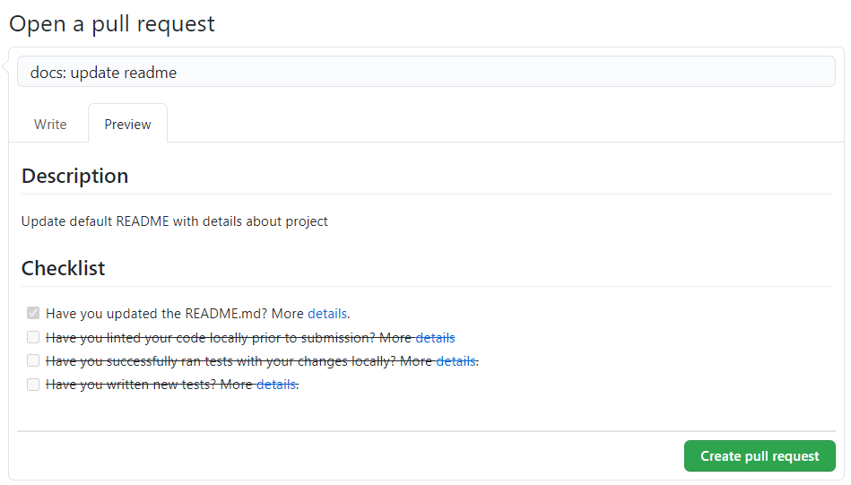
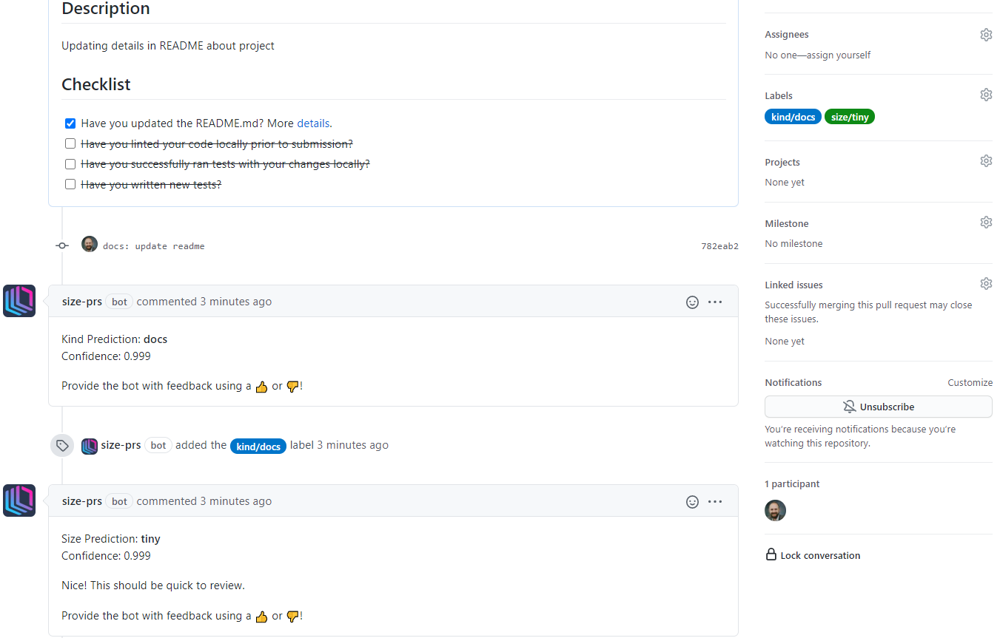

# Size PRs

Size PRs helps your team by automatically categorising PRs by kind and size using AI.

It will nudge your contributors to create better PRs.

And you can extend your workflow using these new labels!

---

**Size** will be classified as one of:
tiny, small, medium, large or huge.

**Kind** will be classified as one of: feature, fix, breaking, docs, test, refactor, chore, performance or style.

## Usage

### 1. Create a PR

  

### 2. Watch for feedback! :tada:

### 3. Update your PR

When you change the PR, the `kind` and `size` will be recalculated.

If either changes, the label will be updated, a new comment will be added, and the previous comment will be hidden; keeping your PR tidy.

## Bonus: Extend your existing workflow

Use the labels to automatically take actions and make contributing awesome.

###  Examples

1. Automatically Merge a PR when it's labelled.

    https://github.com/size-prs/merge-pr-example

1. Automatically Close a PR when it's labelled.

    https://github.com/size-prs/close-pr-example

## Plans

1. Open Source

    - Unlimited Public Repositories

1. Small Team

    - Unlimited Public
    - Up to 5 Private Repositories
    - Unlimited Pull Requests

1. Unlimited

    - Unlimited Public and Private Repositories
    - Unlimited Pull Requests
